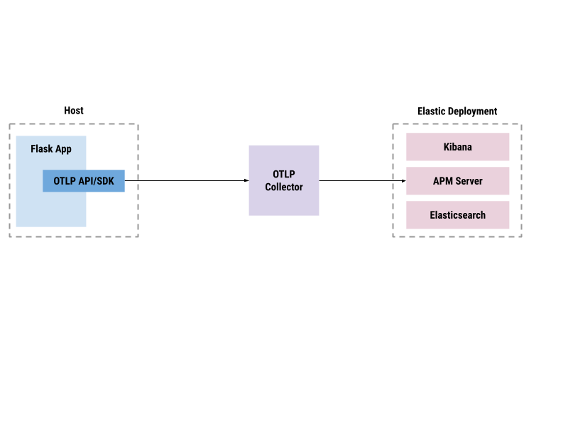

# Overview

Our goal is to set up the following data pipeline and learn about relevant concepts, required installations, configurations and options along the way. The pipeline consists of a simple Flask web application that will run in your host machine. The code will require instrumentation to export spans via OTLP. This data will be be sent to a local OpenTelemetry collector which will also require seting up in the same host as a container using a docker image. The collector should be configured to export the telemetry data to the final destination for analysis which is an Elastic observability deployment. 

In this guide, you will set up the pipeline in the following sequence.

 1. [Set up an Elastic deployment that will serve as the final destination of telemetry data](deploy.md)
 2. [Set up OpenTelemetry collector and configure it to export telemetry data to Elastic APM server](collect.md)
 3. [Instrument the Flask application to send traces to the OpenTelemetry collector](instrument.md)

[Readme](../README.md) \| [Set up an Elastic deployment that will serve as the final destination of telemetry data](deploy.md)